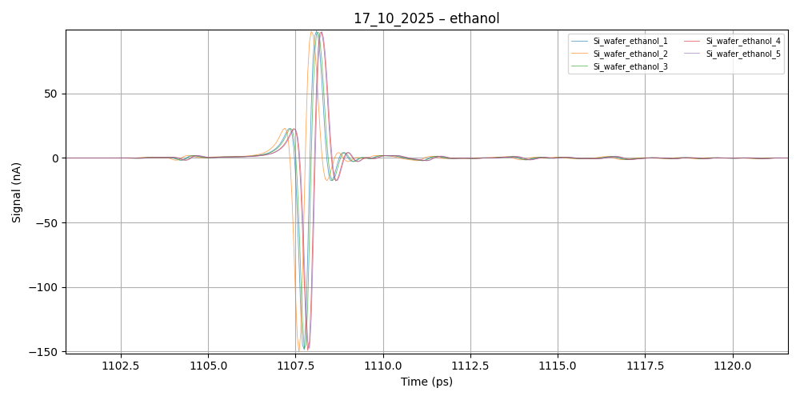
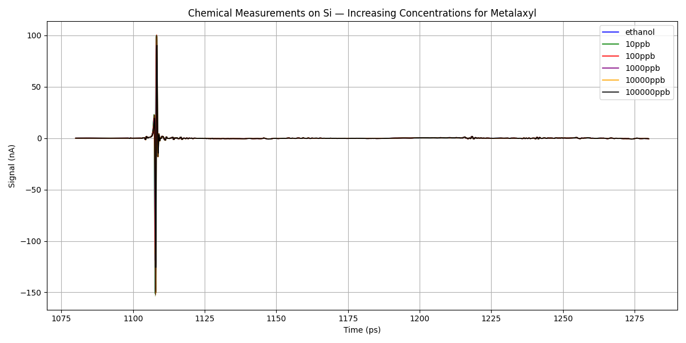
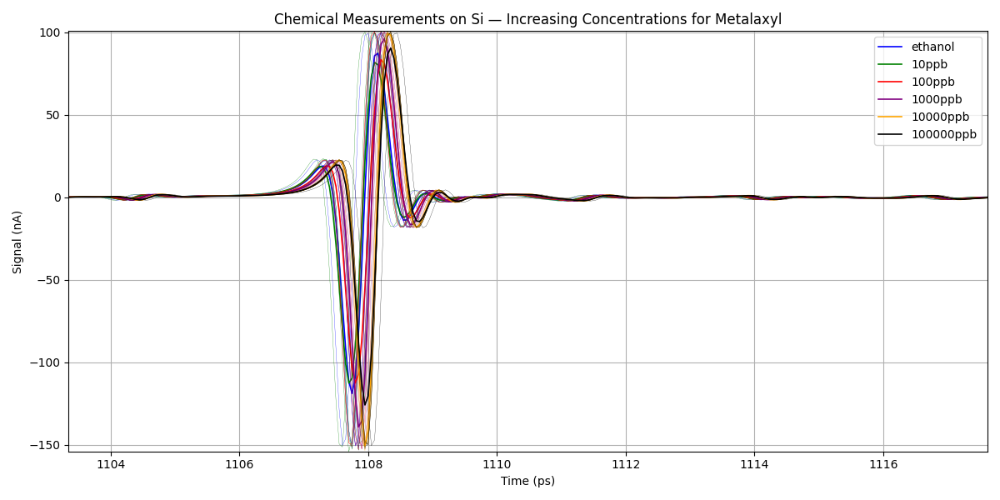
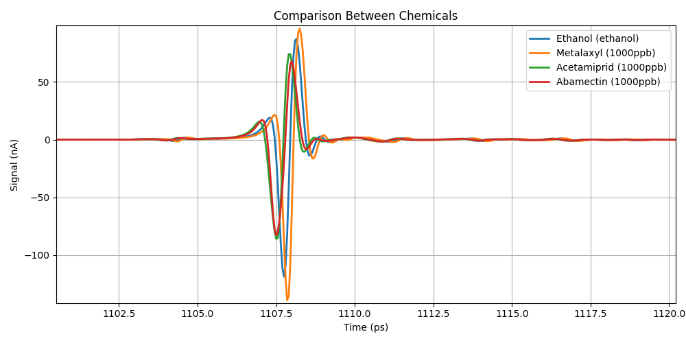
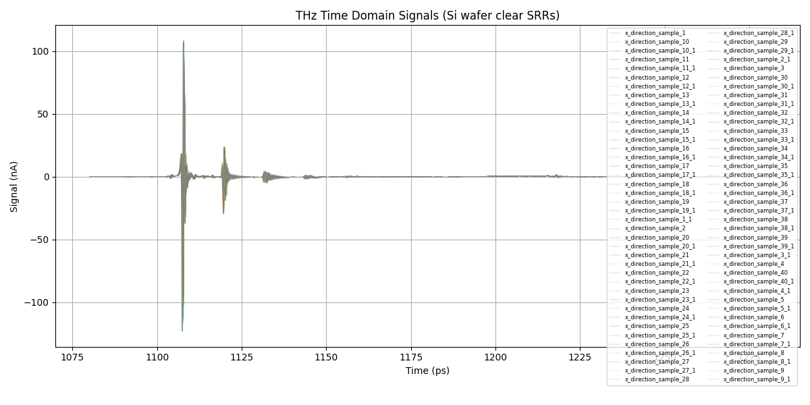
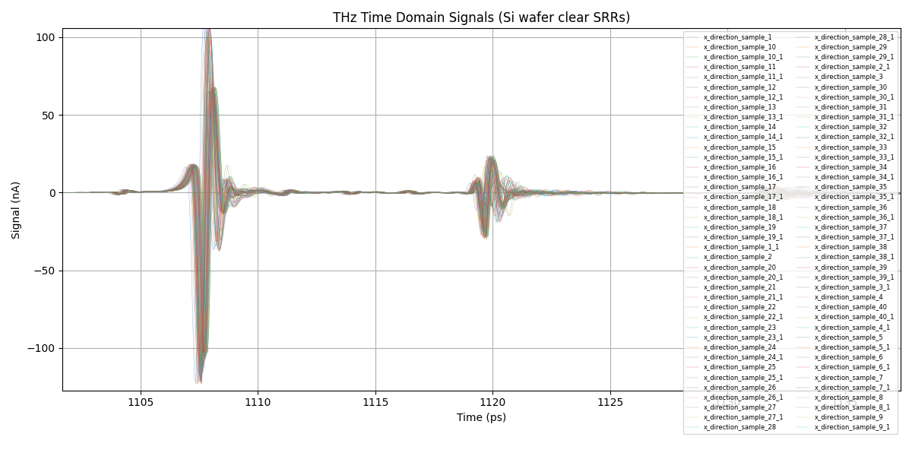
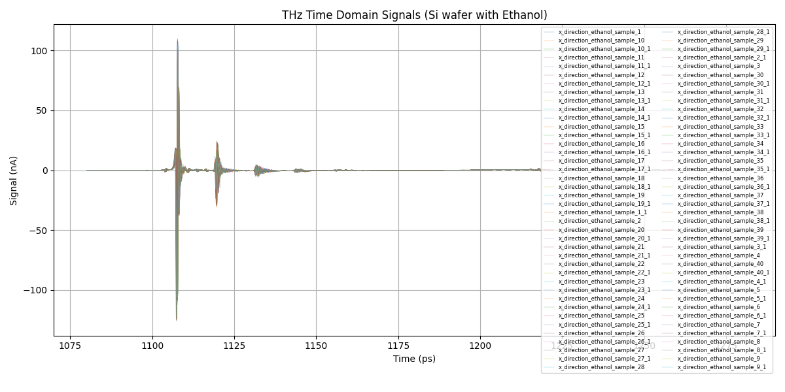
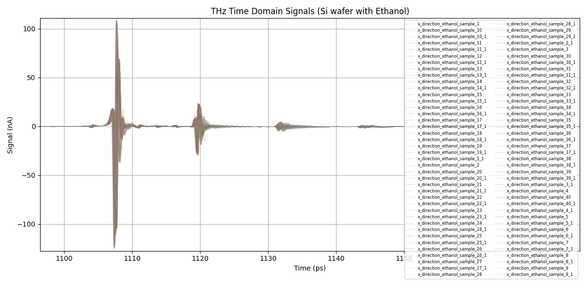

# Experimental Data Presentation
Dionysia Petropoulou, 2025

---

# THz Experimental Setup

--

---

## PART A — CHEMICAL MEASUREMENTS (Bare Si Wafer)

Measurement Plan (Chemicals Only):

- Chemicals: Ethanol, Metalaxyl, Acetamiprid, Abamectin

- Concentrations: 10 ppb → 100000 ppb

- 5 measurements per concentration

---

# Data Format

csv files:

---

# Ethanol (5 measurements)

--

---

# Increasing Concentration (Metalaxyl)

--

---

# Comparing Chemicals

---

## PART B — METAMATERIAL MEASUREMENTS (SRRs)

SRR Wafer Overview:

- 40 unique SRRs × 2 duplicates = 80

- SRRs tuned across 0–5.5 THz

---

# SRR Measurement: Clear Wafer (80 Curves)

--

---

# SRR + Ethanol

--

---

# Key Takeaways

- THz measurements were performed on pure chemicals and metamaterial structures.

- Chemical-only measurements established baseline THz signatures across concentrations.

- SRR-based measurements revealed the metamaterial resonance behavior under environmental loading (ethanol).

---

### Thank you!

