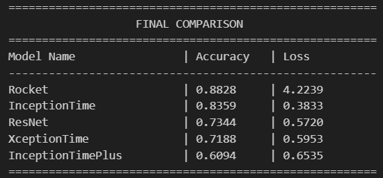

# First results of Experimental Data
Dionysia Petropoulou, 18/12/2025

---

# Frequency-Domain Analysis of Class-Specific Signal Patterns

--

--

---

# Multiclass Classification Results

We test 5 models:
- ROCKET (baseline)
- InceptionTime
- InceptionTimePlus
- ResNet 
- XceptionTime

Using 7 classes:  
0: clear, 1: Ethanol, 2: Acetamiprid 10ppb, 3: Acetamiprid 100ppb, 4: Acetamiprid 1000ppb, 5: Acetamiprid 10000ppb and 6: Acetamiprid 100000ppb

--

---

# Binary Classification Results

We test the 5 models using 2 classes:  
0: clear, Ethanol, Ethanol, Acetamiprid 10ppb  
1: Acetamiprid 100ppb, Acetamiprid 1000ppb, Acetamiprid 10000ppb, Acetamiprid 100000ppb

--

