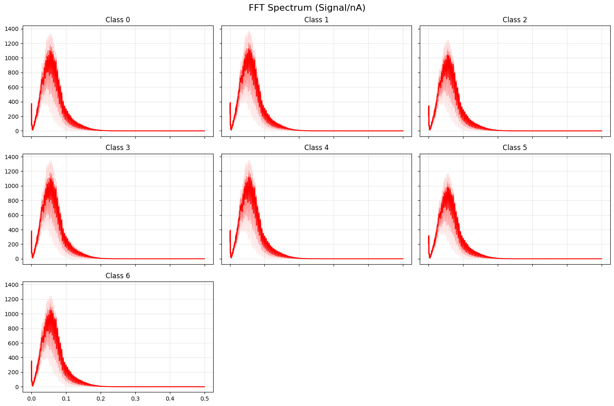
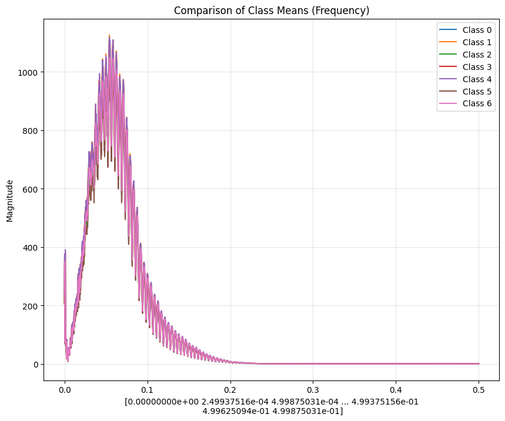
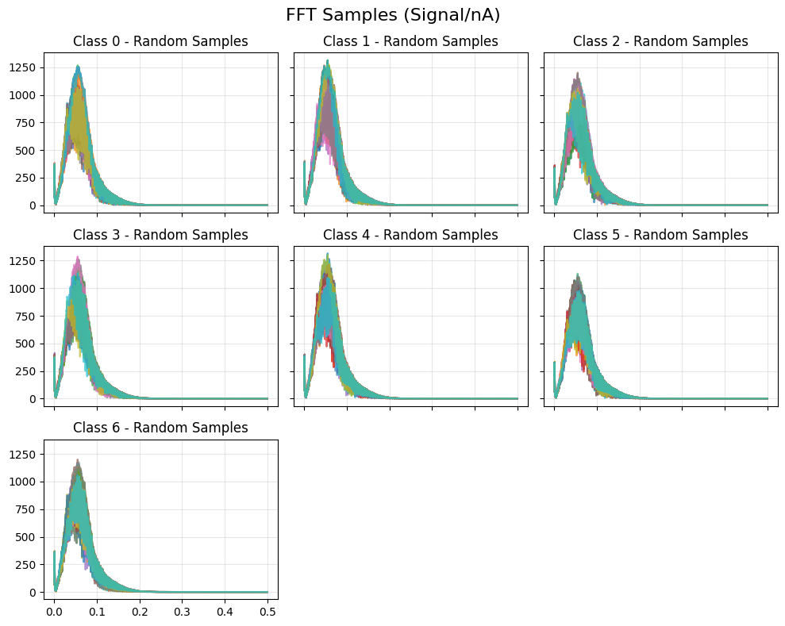
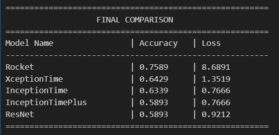

# First results of Experimental Data
Dionysia Petropoulou, 18/12/2025

---

# Frequency-Domain Analysis of Class-Specific Signal Patterns

--

--

---

# Multiclass Classification Results

We test 5 models:
- ROCKET (baseline)
- InceptionTime
- InceptionTimePlus
- ResNet 
- XceptionTime

--

