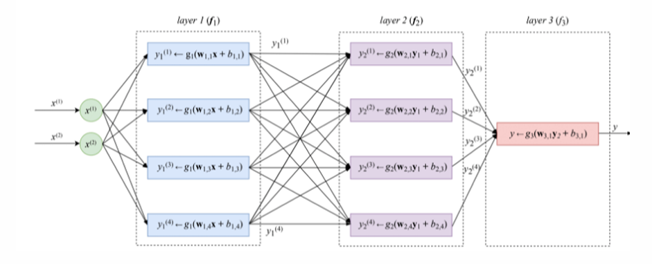

# Deep learning for time series classification: a review

Dionysia Petropoulou, 2025

---

# Table of contents

- Motivation & Problem
- Why Deep Learning?
- Main Contributions
- Background: What is TSC?
- Deep Learning for TSC
- Example Architectures
- Key Findings
- Interpretability
- Conclusions
- References & Questions

---

#  Why Time Series Classification?

Time series data is everywhere:

- Health (ECG)

- Finance (stocks)

- Wearable sensors

Traditional methods:

- NN-DTW

- HIVE-COTE (accurate but slow/complex)

---

# Why Deep Learning?

- Huge success in images, speech, text

- Learns features automatically

- Question: Can it match or beat state-of-the-art TSC methods?

---

# Main Contributions

---

# Background: What is TSC?

TSC = Learn patterns in sequences to predict classes.

--
## What is Time Series Classification?

- \textbf{Univariate:} \quad X = [x_1, \ldots, x_T] 
- \textbf{Multivariate:} \quad X = [X^1, \ldots, X^M] 
- \textbf{Dataset:} \quad D = \{ (X_i, Y_i) \}_{i=1}^N 
- \textbf{Objective:} \quad p(Y \mid X)

--
## The multilayer perceptron

- \textbf{Deep network composition:} 
f_L(\theta_L, x) = f_{L-1}(\theta_{L-1}, \ldots, f_1(\theta_1, x)) 
- \textbf{Layer activation (MLP):} 
 A^{(l)} = f(\omega^{(l)} * X + b^{(l)}) 

- \textbf{Cross-entropy loss:} L(X) = -\sum_{j=1}^K Y_j \log(\hat{Y}_j) \\[10pt]
- \textbf{Dataset loss:} 
 J(\Omega) = \frac{1}{N} \sum_{n=1}^N L(X_n) \\[10pt]
- \textbf{Gradient descent update:} 
 \omega \leftarrow \omega - \alpha \cdot \frac{\partial J}{\partial \omega},
  \quad \forall \omega \in \Omega
--

---

# Deep Learning for TSC

---

# Example Architectures

Different model types tested:

- MLP

- CNN variants

- Echo State Networks
--

--

---

# Key Findings

- Deep learning models outperform NN-DTW

- Comparable to HIVE-COTE

- Much faster and scalable

- Good on multivariate data

- Sensitive to initialization
---

# Interpretability

Black-box problem in DNNs

- Solution: Class Activation Maps (CAM)

- Highlights important time steps

- Improves trust
--

---

# Conclusions

Deep learning is effective:

- High accuracy

- Scalable

- Less manual feature engineering

Challenges remain:

- Overfitting

- Interpretability

- Transfer learning

---

### 🦧 Thank you! 🦧

Questions?

