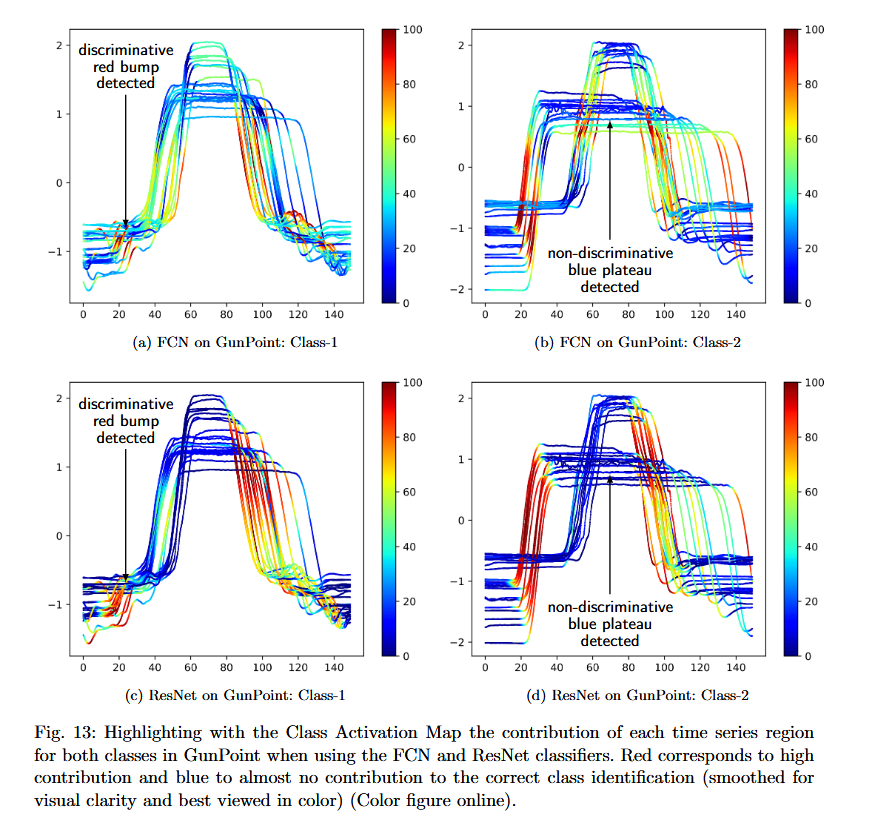

# Deep learning for time series classification: a review

Dionysia Petropoulou, 2025

---

# Table of contents

- Motivation & Problem
- Why Deep Learning?
- Main Contributions
- Background: What is TSC?
- Deep Learning for TSC
- Example Architectures
- Key Findings
- Interpretability
- Conclusions
- References & Questions

---

#  Why Time Series Classification?

Time series data is everywhere:

- Health (ECG)

- Finance (stocks)

- Wearable sensors

Traditional methods:

- NN-DTW

- HIVE-COTE (accurate but slow/complex)

---

# Why Deep Learning?

- Huge success in images, speech, text

- Learns features automatically

- Question: Can it match or beat state-of-the-art TSC methods?

---

# Main Contributions

---

# Background: What is TSC?

TSC = Learn patterns in sequences to predict classes.

--
## Vertical slide 1

This is a vertical slide under the parent slide.

--
## Vertical slide 2

Another vertical slide under the parent slide.

---

# Deep Learning for TSC

Add a figure with Markdown code

---

# Example Architectures

Different model types tested:

- MLP

- CNN variants

- Echo State Networks
--

--

---

# Key Findings

- Deep learning models outperform NN-DTW

- Comparable to HIVE-COTE

- Much faster and scalable

- Good on multivariate data

- Sensitive to initialization
---

# Interpretability

Black-box problem in DNNs

- Solution: Class Activation Maps (CAM)

- Highlights important time steps

- Improves trust
--

---

# Conclusions

Deep learning is effective:

- High accuracy

- Scalable

- Less manual feature engineering

Challenges remain:

- Overfitting

- Interpretability

- Transfer learning

---

### 🦧 Thank you! 🦧

Questions?

