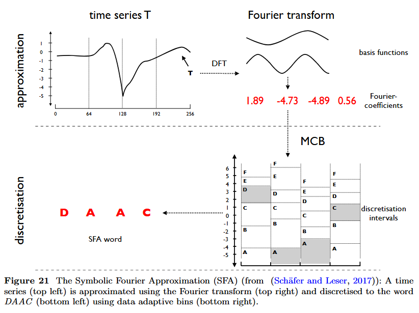
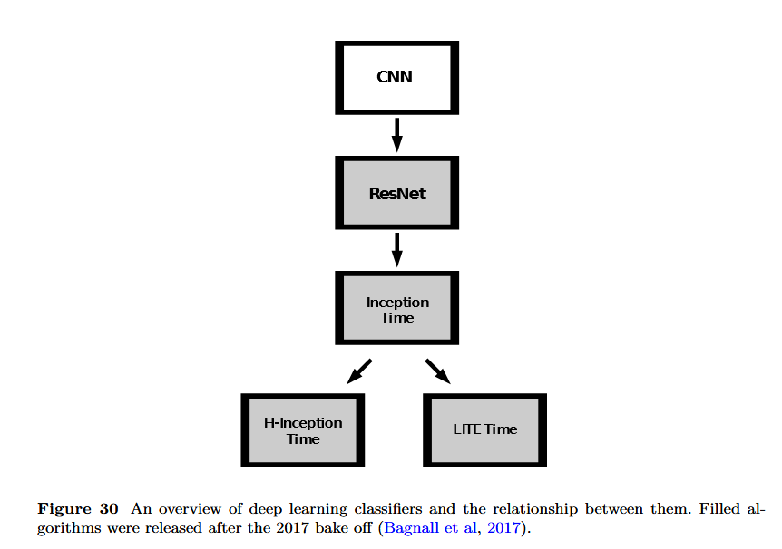

# Bake off redux: a review and experimental evaluation of recent time series classification  algorithms
Matthew Middlehurst, Patrick Schafer, Anthony Bagnall (2024)  
Dionysia Petropoulou, 2025

---

# Table of contents
- Background & Objectives
- Definitions & Terminology
- Experimental Setup
- Taxonomy of Algorithms
- Deep Learning Methods
- Conclusions & Insights

---

# Motivation

- Revisits the 2017 “bake-off” comparing 18 Time Series Classification (TSC) algorithms
 on 85 datasets.

- TSC field has expanded → 112 datasets, many new algorithms.

- Goal: evaluate progress and identify state-of-the-art methods.

---

# Background & Objectives

- Time Series Classification (TSC): predicting class labels from sequential data.

- 2017 bake-off: 5 categories (distance, interval, shapelet, dictionary, hybrid).

- This study adds 3 new categories: convolution-based, feature-based, and deep learning.

- Objectives:

  - Review and evaluate new TSC algorithms (2017–2023).

  - Compare to previous best-in-class.

  - Extend dataset benchmark with 30 new problems.

---

# Definitions & Terminology

  - Time Series (TS): ordered sequence of values $A = [a_1, \ldots, a_m]$
  - Multivariate TS (MTS): each observation $a_i \in \mathbb{R}^d$
  - Dataset: collection of time series
$$
D = \{(A^{(i)}, y^{(i)})\}
$$

-  Subseries: contiguous subsequence $A_{i,l}$.

- Sliding Window: generates all subseries of length l.
- Convolution: sliding dot product between a kernel and a time series.
- Dilation: spaced sampling for multi-scale analysis.

--

---

# Experimental Setup

- 112 datasets from UCR archive + 30 new datasets.

- 30 resamples per dataset for reproducibility.

- Metrics: Accuracy, Balanced Accuracy, AUROC, Negative Log Likelihood.

- Benchmark: 1-Nearest Neighbour with Dynamic Time Warping (DTW).

- Visual: schematic of critical difference plots or dataset table.

--

Original sequences:  
A = [1, 2, 3]  
B = [1, 1, 2, 3]  

DTW Alignment (with stretching):  
A: 1   →   1   →   2   →   3   
      ↘     ↓     ↘     ↘   
B:    1   → 1   → 2   → 3   

| Step | A Index | A Value | B Index | B Value | Alignment Action      |  
| ---- | ------- | ------- | ------- | ------- | --------------------- |  
| 1    | 1       | 1       | 1       | 1       | Match                 |  
| 2    | 1       | 1       | 2       | 1       | Stretch A (stay on 1) |  
| 3    | 2       | 2       | 3       | 2       | Match                 |  
| 4    | 3       | 3       | 4       | 3       | Match                 |  

---

# Taxonomy of Algorithms

- Distance-based

- Feature-based

- Interval-based

- Shapelet-based

- Dictionary-based

- Convolution-based

- Deep learning-based

- Hybrid

---

# Distance-based

- Classification is based on comparing whole time series using a distance measure.

- Most common example: Dynamic Time Warping (DTW).

- Idea: the class of a new series is predicted by finding the closest series in the training set.

- No training phase – it’s a lazy learner.

- Good at handling time distortions (e.g., same pattern occurring faster or slower).

Key strength: Simple and often surprisingly accurate baseline  
Key weakness: Computationally expensive for large datasets

--

Time Series → Distance Measure (e.g., DTW) → Nearest Neighbor Search → Predicted Class

---

# Feature-based

- Instead of using the raw time series, these models extract global features (like mean, variance, slope, autocorrelation).

- Features then go into a standard classifier (e.g., Random Forest, SVM).

- These features summarize entire time series into a fixed-length vector.

Key strength: Interpretable & fast to classify  
Key weakness: May lose local/temporal structure

--

Time Series → Feature Extraction (mean, std, entropy, etc.) → Classifier (SVM/Random Forest) → Predicted Class

---

# Interval-based

- The time series is divided into intervals (segments).

- Features (like mean, standard deviation, slope) are extracted from selected intervals.

- Ensembles of models choose the most informative intervals for classification.

Key strength: Captures phase-dependent patterns (events happening at specific times)  
Key weakness: May miss patterns that shift over time

--

--

Time Series → Select Intervals → Extract Features per Interval → Ensemble of Classifiers → Predicted Class

---

# Shapelet-based

- Shapelets are small, phase-independent subseries that are highly discriminative for classes.

- Classification is based on whether a specific pattern appears anywhere in the series, regardless of position.

- Focuses on what pattern occurs, not when.

Key strength: Very interpretable (shapelets can be visualized)  
Key weakness: Discovering shapelets can be computationally expensive

--

Time Series → Search for Discriminative Subseries (Shapelets) → Measure Shapelet Distances → Classifier → Predicted Class

---

# Dictionary-based

- Converts time series into a sequence of symbolic words using for ex. Symbolic Fourrier Approximation.

- Then builds a histogram of repeating patterns.

- Classification is based on these word counts.

Key strength: Good at capturing repeating local patterns  
Key weakness: Loses precise numeric details due to discretization

--

Time Series → Convert to Symbols (SFA) → Build Histogram of Patterns → Classifier → Predicted Class

--

---

# Convolution-based

- Uses convolutional neural networks (CNNs).

- Convolutions detect local patterns, pooling reduces dimensionality.

- Learns multi-scale temporal features automatically from raw data.

Key strength: Very powerful and scalable with large data  
Key weakness: Requires more computational resources and data than classical methods

--

Time Series → Convolution Layers → Pooling Layers → Fully Connected Layer → Predicted Class

---

# Deep Learning-based

--

Raw Time Series  
   ↓  
( CNN | ResNet | InceptionTime | Transformers )  
   ↓  
Automatically Learned Features  
   ↓  
Softmax / Dense Layer  
   ↓  
Predicted Class  

--

# Convolutional Neural Network

--

# Residual Network (ResNet)

--

# Inception Time

--

# H-InceptionTime (Hybrid inception)

H-InceptionTime = a hybrid version of the InceptionTime model.
- It combines the strengths of InceptionTime (multi-scale feature learning) and ResNet (residual connections that stabilize deep training).

--

# LITEtime (Light Inception with boosTing tEchniques).

- LITE: nearly the same accuracy, much faster and easier to train.
Great for real-time or low-resource applications.

---

# Conclusions & Insights

- **H-inception time** delivers the **highest accuracy** among tested deep learning models.  
- Combines:
  - InceptionTime’s **multi-scale pattern detection**, and  
  - ResNet’s **residual connections** for stable training.  
- Efficient thanks to **bottleneck layers**.  
- Outperforms both **ResNet** and **plain InceptionTime**.  
- **Best trade-off** between accuracy, stability, and computation cost.

--

---

Thank you!  

