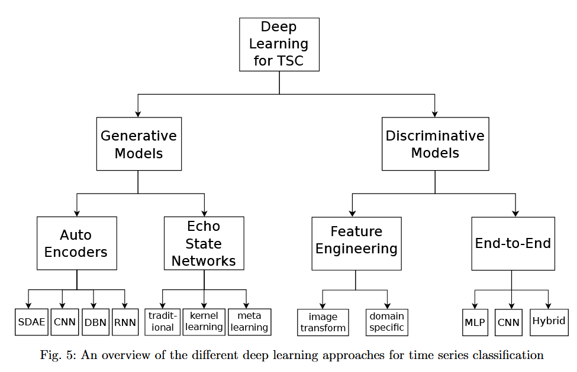

# Bake off redux: a review and experimental evaluation of recent time series  
# classification  algorithms
Matthew Middlehurst, Patrick Schafer, Anthony Bagnall (2024)  
Dionysia Petropoulou, 2025

---

# Table of contents
- Background & Objectives
- Definitions & Terminology
- Experimental Setup
- Taxonomy of Algorithms
- Distance & Feature based Methods
- Interval & Shapelet-Based Methods
- Dictionary & Convolution-Based Methods
- Deep Learning-Based Methods
- Hybrid & Ensemble Approaches
- Results Summary
- Conclusions & Insights

---

# Motivation

- Revisits the 2017 “bake-off” comparing 18 TSC algorithms on 85 datasets.

- TSC field has expanded → 112 datasets, many new algorithms.

- Goal: evaluate progress and identify state-of-the-art methods.

---

# Background & Objectives

- Time Series Classification (TSC): predicting class labels from sequential data.

- 2017 bake-off: 5 categories (distance, interval, shapelet, dictionary, hybrid).

- This study adds 3 new categories: convolution-based, feature-based, and deep learning.

- Objectives:

  - Review and evaluate new TSC algorithms (2017–2023).

  - Compare to previous best-in-class.

  - Extend dataset benchmark with 30 new problems.

  ---

  # Definitions & Terminology

  - Time Series (TS): ordered sequence of values $A = [a_1, \ldots, a_m]$
  - Multivariate TS (MTS): each observation $a_i \in \mathbb{R}^d$
  - Dataset: collection of time series
$$
D = \{(A^{(i)}, y^{(i)})\}
$$

-  Subseries: contiguous subsequence A_{i,l}.

- Sliding Window: generates all subseries of length l.
- Convolution: sliding dot product between a kernel and a time series.
- Dilation: spaced sampling for multi-scale analysis.

--

---

# Experimental Setup

- 112 datasets from UCR archive + 30 new datasets.

- 30 resamples per dataset for reproducibility.

- Metrics: Accuracy, Balanced Accuracy, AUROC, Negative Log Likelihood.

- Benchmark: 1-NN Dynamic Time Warping (DTW).

- Visual: schematic of critical difference plots or dataset table.

---

# Taxonomy of Algorithms

- Distance-based

- Feature-based

- Interval-based

- Shapelet-based

- Dictionary-based

- Convolution-based

- Deep learning-based

- Hybrid

---

# Distance & Feature based Methods

---

# Interval & Shapelet-Based Methods
# Dictionary & Convolution-Based Methods
# Deep Learning-Based Methods
# Hybrid & Ensemble Approaches
# Results Summary
# Conclusions & Insights

