# Experimental Data Presentation
Dionysia Petropoulou, 2025

---

# THz Experimental Setup

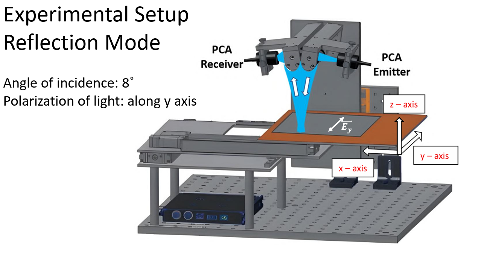

--

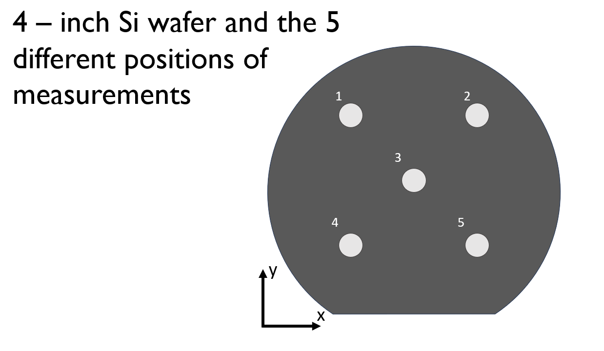

---

## PART A — CHEMICAL MEASUREMENTS (Bare Si Wafer)

Measurement Plan (Chemicals Only):

- Chemicals: Ethanol, Metalaxyl, Acetamiprid, Abamectin

- Concentrations: 10 ppb → 100000 ppb

- 5 measurements per concentration

---

# Data Format

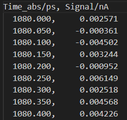

--

- Time delay → when each part of the pulse arrives
- THz electric field → how strong the pulse is at that moment

Together, they give the full time-domain waveform, which contains all the information about:

- the sample

- the chemicals

- the SRRs

- how they modify the THz wave

---

# Ethanol vs Acetamiprid 100000ppb (5 measurements)

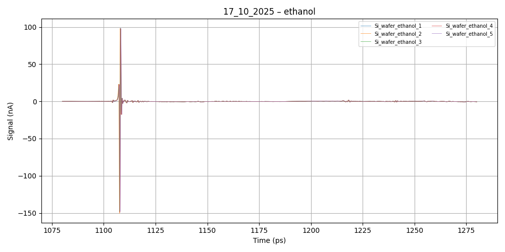

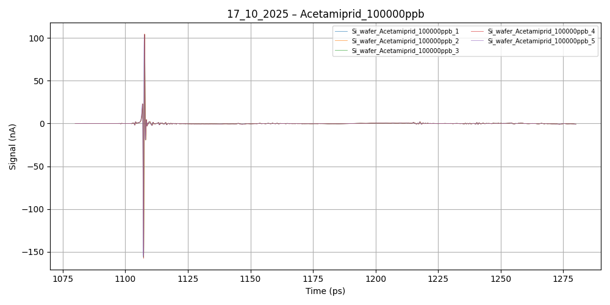

---

## PART B — METAMATERIAL MEASUREMENTS (SRRs)

- SRRs: tiny metal rings with a gap
- They behave like small antennas that have a specific resonant frequency in the THz range

- When something changes around them (like a chemical being deposited ) their resonance shifts, and we can measure that

--

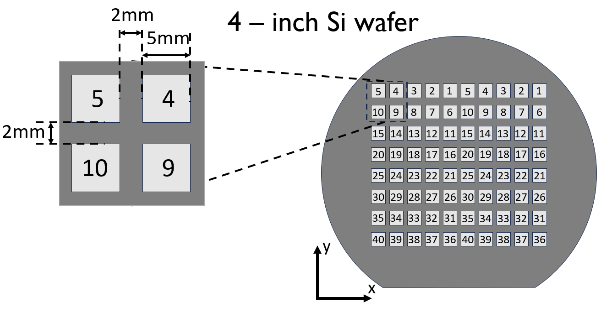

---

# SRR Results – clear vs ethanol

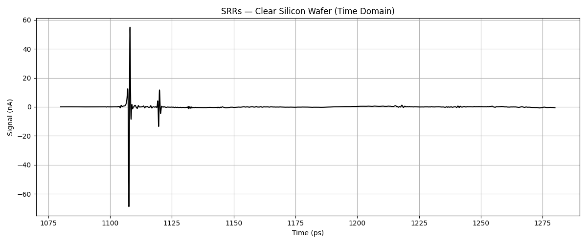

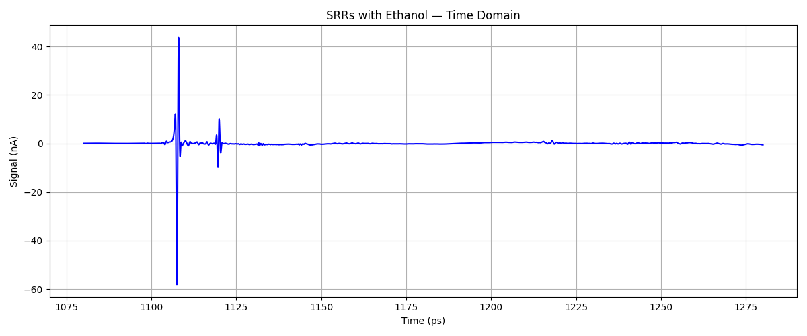

--

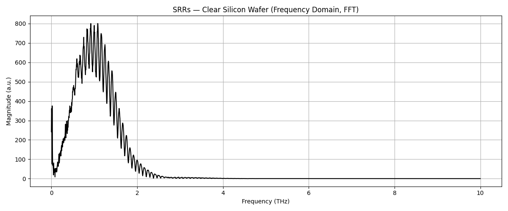

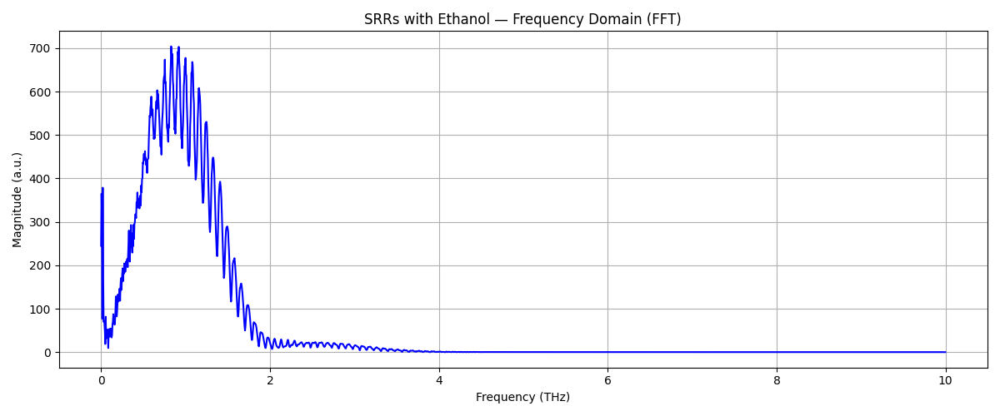

---

# SRR with 10ppb and 100 ppb of Acetamiprid

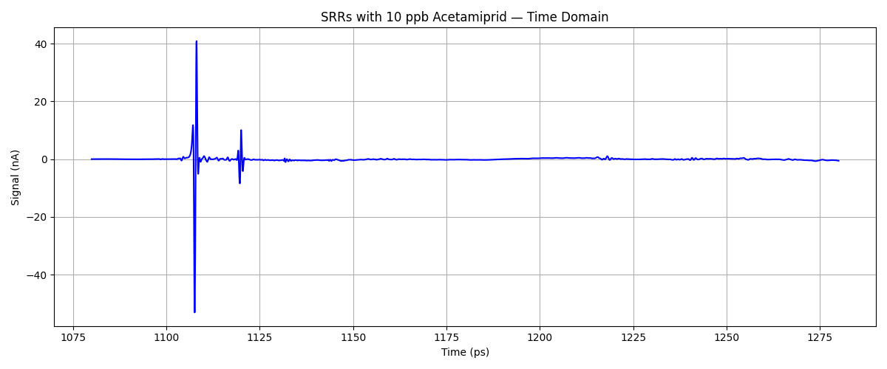

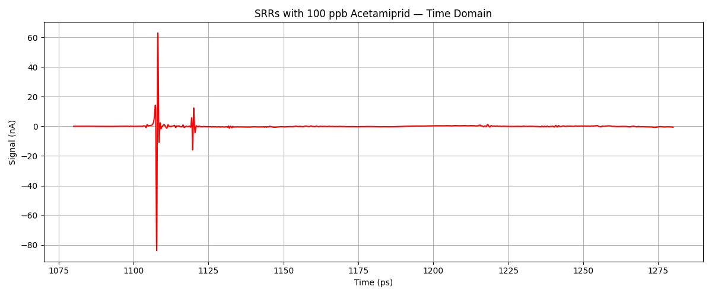

--

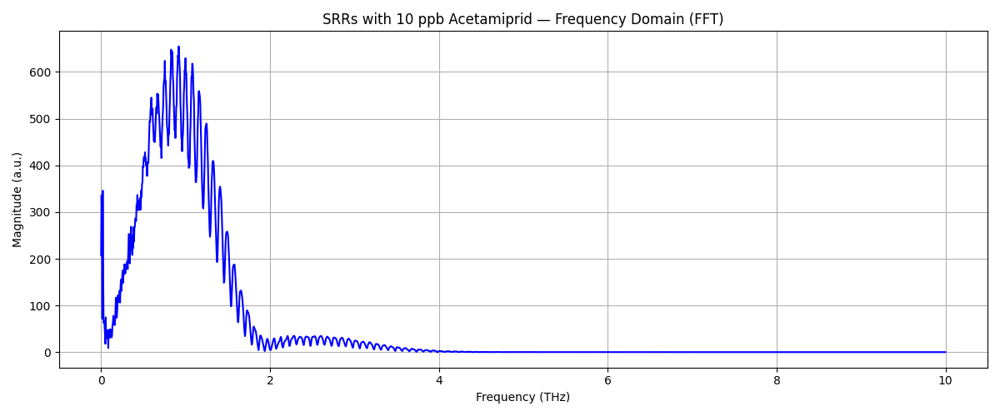

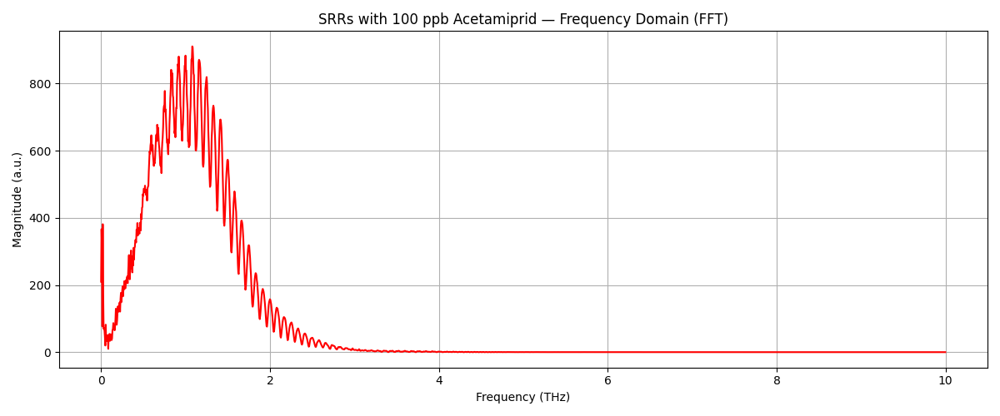

---

# Summary / Conclusions

- Clear SRRs: ~1.15 THz
- 100 ppb Acetamiprid: ~1.22 THz
- The resonance shifts upward by ~0.05–0.07 THz (50–70 GHz) when we add 100 ppb of acetamiprid

- Time-domain signals look similar because chemical layer is thin

- SRRs show clear resonance in FFT

- Ethanol and acetamiprid shift the resonance

- SRRs → excellent THz sensors

---

### Thank you!

